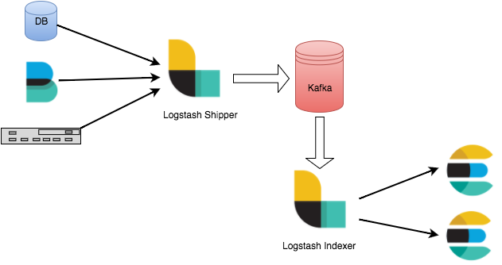

### How to start

Create a copy of `.env.default` file and change the filename to `.env`.

open `.env` file and fill password environment variables.

Now run the following command

```powershell
docker compose up -d
```

### Architecture (ELK Stack + Kafka)



#### Containers
  - Elasticsearch
  - Kibana
  - Metricbeat
  - Logstash
  - Kafka
  - Kafka UI

